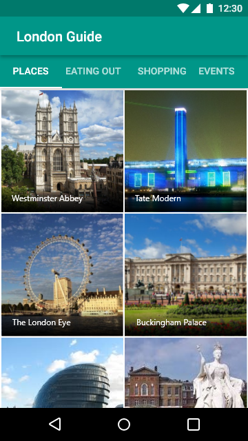
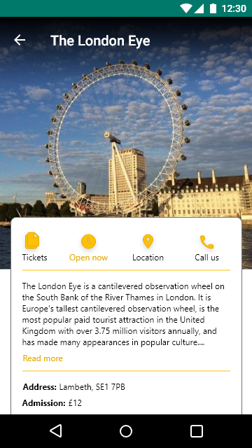
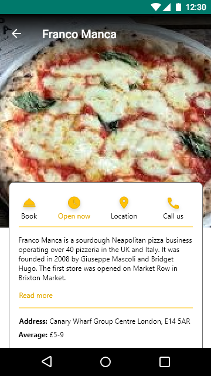
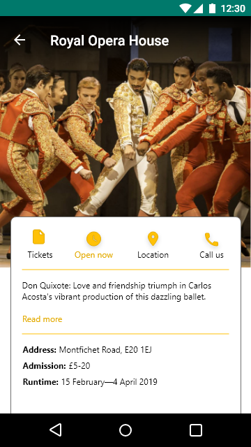
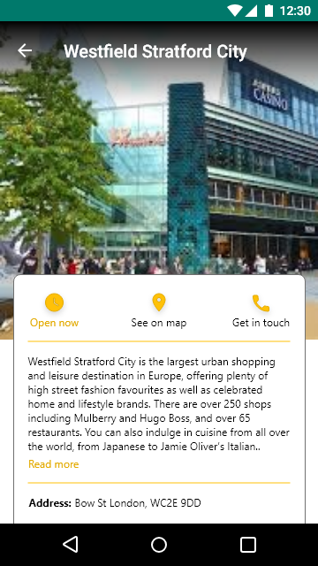

# ABND | TourGuideApp
The goal is to create a tour guide app which presents relevant information to a user who’s visiting your city. The app can list top attractions, restaurants, public places, or events for the city. It can contain all the best known secrets that only locals know.
This is the sixth project completed for the Android Basics Nanodegree program offered by Udacity in collaboration with Google. This is a proposed design for the Android app.

 
 

# Pre-requisites
Android SDK v22 Android Build Tools v22.0.1 Android Support Repository v22.1.1

# Learning objectives

This project is about combining various ideas and skills we’ve been practicing throughout the course. They include:

- Planning the app design and navigation before coding.
- Selecting proper data structures to store lists of information.
- Building layouts to display those lists of data.
- Navigating between those lists using intents and multiple Activities or a ViewPager.
- Creating custom classes.
- Properly handling images or audio (if applicable).
